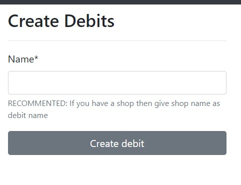
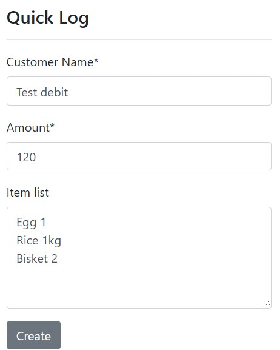
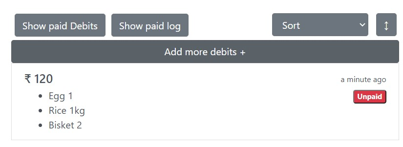

- You need to catagorize your debits or name the debits. For example if you have a shop then give the name of shop as debit name

- After creating debit you will be taken to a screen saying "You don't have debit log". On the right side you can see a form

- Then you will see debit in your list. Here in the pic below you can see two buttons on left side.*Show paid debits* will show paid debits that means if you click the *Unpaid* button this debit will paid debits. 

